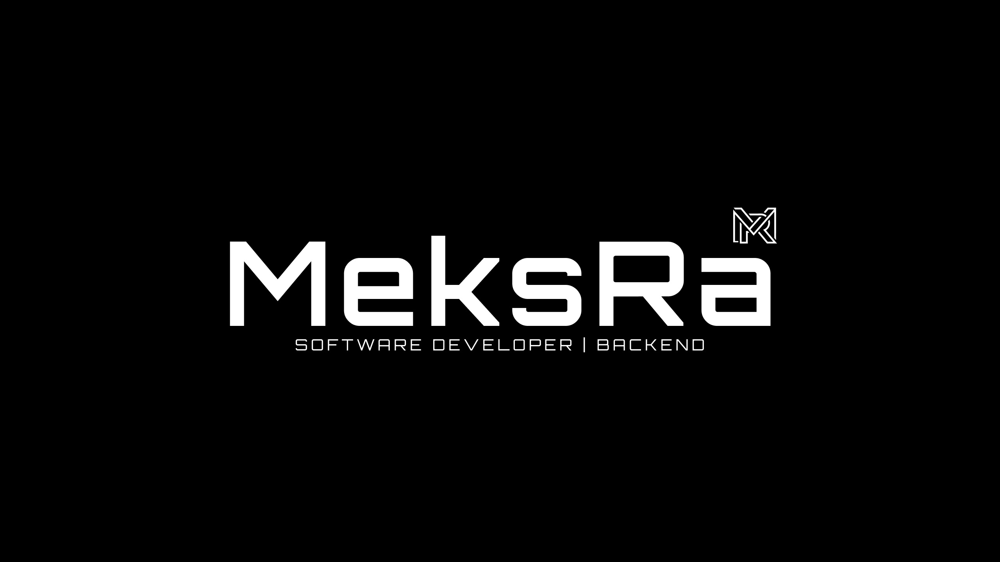

  

# dev-lab

Personal development lab for CS theory, code experiments, and learning projects.

## 📌 Repository Structure

* **`python/`** — Core Python topics, language mechanics, and structured exercises (basics, functions, OOP, etc.).
* **`projects/`** — Small practice projects and practical assignments completed during the course.
* **`drafts/`** — Permanent working drafts, code experiments.
* **`snippets/`** — Live templates and editor configurations (JSON).
* **`NOTES.md`** — Personal cheat sheet for hotkeys, CLI commands, and editor workflows.

## 🛠 Tech Stack & Tools

* **Language:** Python 3.14
* **Environment:** VS Code, Git
* **Formatting & Linting:** Ruff

---
Maintained by [MeksRa](https://github.com/MeksRa)
